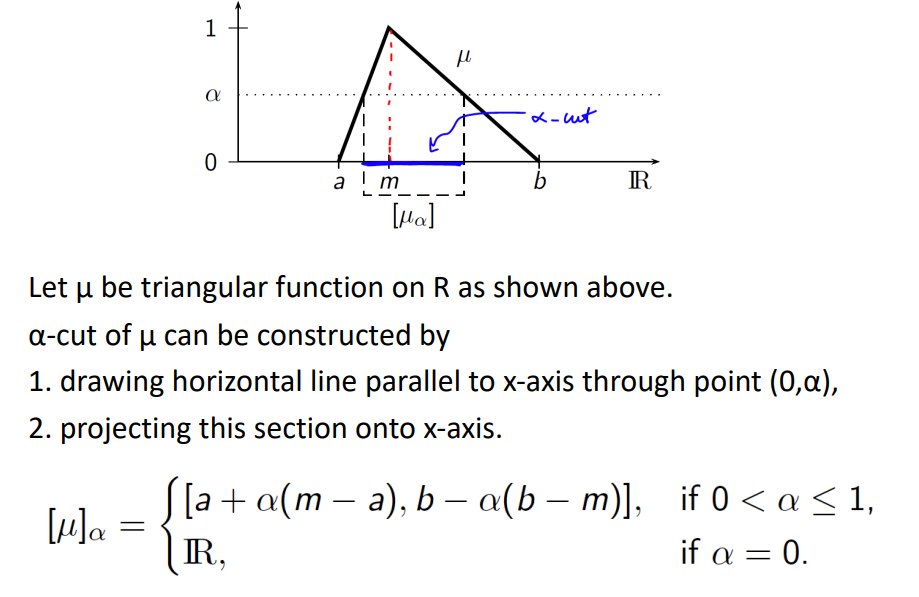
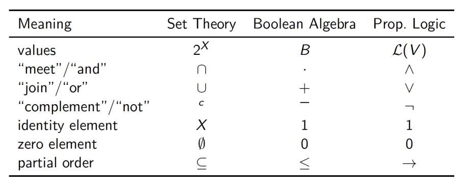

## Fuzzy Systems ##

### Fuzzy Set Theory ###
----

*“By a set we understand every collection made into a whole of definite, 
distinct objects of our intuition or of our thought.”* (Georg Cantor).

For a set in Cantor’s sense, the following properties hold:
- x≠{x}.
- If x ∈ X and X ∈ Y , then x ∈ Y .
- The Set of all subsets of X is denoted as 2ˣ.
- ∅ is the empty set and thus very important.

**Definition**
A fuzzy set μ of X≠∅  is a function from the reference set X to the
unit interval, i.e. μ : X → [0, 1]. F(X) represents the set of all fuzzy
sets of X, i.e. F(X) def = {μ | μ : X → [0, 1]}

Aplha cut of a fuzzy set is the set of all elements of X that have a membership value greater than or equal to alpha.
Indicator function or characteristic function of a set A ⊆ X is defined as:
$$
\chi_A(x) = \left\{
        \begin{array}{ll}
            1 & \quad x \in A \\
            0 & \quad 0 < A < 1 \\
        \end{array}
    \right.
$$

#### Fuzzy Set Representation ####

Fuzzy sets are stored as a chain of linear lists for each $\alpha$ level, $\alpha \not = 0 $

**Support of a Fuzzy Set**
The support of a fuzzy set is the set of all elements of X that have a membership value greater than zero.
$$
S(\mu) = \{x \in X | \mu(x) > 0\}
$$

**Core of a Fuzzy Set**
The core of a fuzzy set is the set of all elements of X that have a membership value equal to one.
$$
C(\mu) = \{x \in X | \mu(x) = 1\}
$$

**Height of a Fuzzy Set**
The height of a fuzzy set is the maximum membership value of the fuzzy set.
$$
h(\mu) = \max_{x \in X} \mu(x)
$$

A fuzzy set is called **normal** if its height is equal to one. Called **subnormal** if its height is less than one.

**Convex Crisp Set** :
A fuzzy set $\mu$ is called convex if for all $x, y \in X$ and $\alpha \in [0, 1]$ the following holds:
$$
\mu(\alpha x + (1 - \alpha)y) \geq \min(\mu(x), \mu(y))
$$

$$ \textrm{in other words}$$

$$
\mu(\alpha x + (1 - \alpha)y) \geq S(\mu)
$$

**Convex Crisp Set** :
Let X be a vector space. A fuzzy set $\mu$ is called convex if all its $\alpha$-cuts are convex crisp sets.

**Fuzzy Set Operations**

**Union**
$$
\mu_1 \cup \mu_2 = \max(\mu_1(x), \mu_2(x))
$$

**Intersection**
$$
\mu_1 \cap \mu_2 = \min(\mu_1(x), \mu_2(x))
$$

**Complement**
$$
\mu^c = 1 - \mu
$$

**Difference**
$$
\mu_1 - \mu_2 = \max(\mu_1(x) - \mu_2(x), 0)
$$

**Algebraic Sum**
$$
\mu_1 + \mu_2 = \mu_1(x) + \mu_2(x) - \mu_1(x)\mu_2(x)
$$

**Algebraic Product**
$$
\mu_1 \cdot \mu_2 = \mu_1(x) \cdot \mu_2(x)
$$

**Bounded Sum**
$$
\mu_1 \oplus \mu_2 = \min(1, \mu_1(x) + \mu_2(x))
$$

### Boolean Algebra ###
----

The propositional logic based on finite set of logic variables is isomorphic (having same structure) to finite set theory.
Both of these systems are isomorphic to a finite Boolean algebra.

**Boolean Algebra**
A Boolean algebra is a set B together with two binary operations + and ·, a unary operation 0 and a constant 1, such that the following axioms hold for all a, b, c ∈ B:

- (B1) Idempotence :  a + a =a , a · a = a
- (B2) Commutativity :  a + b = b + a , a · b = b · a
- (B3) Associativity :  (a + b) + c = a + (b + c) , (a · b) · c = a · (b · c)
- (B4) Absorption :  a + (a · b) = a , a · (a + b) = a
- (B5) Distribution :  a·(b + c) = (a·b) + (a·c) a + (b·c) = (a+b)·(a + c)
- (B6) Universal Bounds :  a + 0 = a, a + 1 = 1 a ·1 = a, a ·0 = 0
- (B7) Complementary :  a + a’ = 1 a · a’ = 0
- (B8) Involution :  a’’ = a
- (B9) Dualization :  (a + b)’ = a’ · b’ (a · b)’ = a’ + b’

**The Principle of Classic Logic**

The Principle of Bivalence:

“Every proposiLon is either true or false.”
It has been formally developed by Tarski.

Łukasiewicz suggested to replace it by The Principle of Valence:
“Every proposiLon has a truth value.”

ProposiLons can have intermediate truth value, expressed by a 
number from the unit interval [0, 1].

