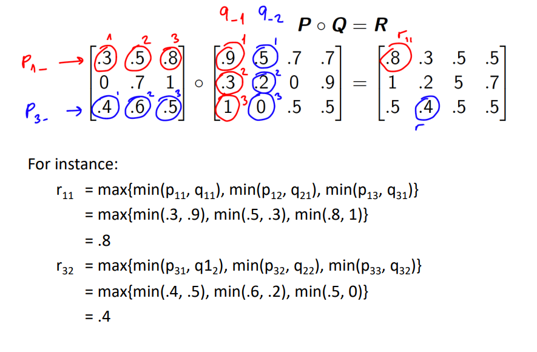
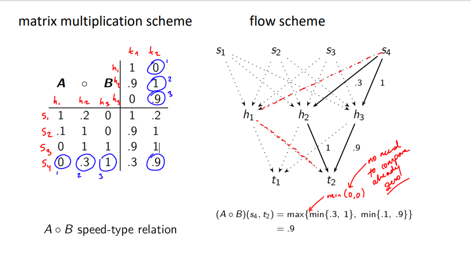

## Fuzzy Logic ##

### Fuzzy Relations ###
----

A Crisp relation represents presence or absence of association, interaction or 
interconnecGon between elements of ≥ 2 sets.

A Fuzzy relation is a generalization of a crisp relation in which the association between elements of ≥ 2 sets is described using the concept of degree in the interval [0, 1].

A **fuzzy relation** generalizes the concept of a crisp relation by allowing the degree of membership in the relation to be any real number in the interval [0, 1].

**Example** - A fuzzy relation between the sets of age and height of people.

### Definition of Relation (Crisp) ###
----

Let X and Y be two sets. A crisp relation R between X and Y is a subset of the Cartesian product X × Y.

**Standart Composition of Relations**

Let X, Y and Z be three sets. Let R be a crisp relation between X and Y and S be a crisp relation between Y and Z. The composition of R and S is a crisp relation between X and Z defined as follows:

$$
R \circ S = \{(x, z) \in X \times Z | \exists y \in Y : (x, y) \in R \land (y, z) \in S\}
$$

Example:

Cont'd:

