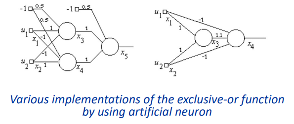

## Neural Networks ##

### Computers versus Brain ###
----
 * Conventional computer => single processor, artihmetic and logic operations, 10^9 operations per second.
     - however, can not adapt to new situations.

 * Brain => 10^11 neurons, 10^14 synapses, 10^3 operations per second.
     - can adapt, learn. 

 Main difference is that in conventional conputer instructions are executed sequentially, while in brain they are executed in massively-parallel fashion and slow.

for our brain, the power dissipation is estimated to be around 10 watts.

### Biological Neuron Structure ### 
-----

**soma** : cell body, where signals are generated and processed.

**dendrites** : receive signals from other neurons.

**axon, (nerve fiber)**: transmit signals to other neurons.
 - axon hillock is between soma and axon, where action potential is generated.

**myelin sheath** : insulates axon, speeds up signal transmission.

**synapse** : junction between axon of one neuron and dendrite of another neuron.

**terminal buttons** : release neurotransmitters.

a neuron typically has 10^4 synapses.

*In general the synapses take place between an axon and a dendrite of two different neurons.*

Cell membrane is polearized, with positive charges on the outside and negative charges on the inside. The **resting potential** is -70 mV. Meaning that the inside of the cell is more negative than the outside.

A breakdown of the transmittance of the signal is as follows:
1. A neuron receives a signal from another neuron via a synaptic connection.
2. Nerve signals arriving at the presynaptic terminal cause the release of neurotransmitters into the synaptic cleft.
3. Neurotransmitters bind to receptors on the postsynaptic membrane.
4. This causes either a decrease or an increase in the concentration of the local sodium or potassium ions.
5. In turn, the soma potential, which is called graded potential, is changed.

synapses which cause depolarization: *excitatory* synapses.  
&nbsp; &nbsp; &nbsp; &nbsp; &nbsp; &nbsp; &nbsp; &nbsp; &nbsp; &nbsp; &nbsp; &nbsp; &nbsp; cause polarization: *inhibitory* synapses.

The neuron firing is a result of the decrease in the resting potential. The threshold potential is -55 mV. When the soma potential reaches this value, the neuron fires. The action potential is a rapid change in the membrane potential, from -70 mV to +40 mV. The action potential is an all-or-none phenomenon, meaning that the neuron either fires or it does not fire.

Generally the depolarization of a single synapse is not enough to cause the neuron to fire.

As the ions diffuse back into the cell, the membrane potential returns to its resting potential. This process is called **refractory period**.

The refractory period is about 1 ms. This limits the maximum firing rate of a neuron to about 1000 Hz.

Myelin sheath is a poor conductor. At the nodes of Ranvier, the sheath is thin.

**The signal transmission in nervous system has a digital nature. The signal is either present or absent. However, the intensity of a neuron signal is coded in the frequency of the pulses.**

 \- sending side releases transmitter substances.

### Artificial Neuron Model ###
-----
For a given artificial neuron k, let there be m + 1 inputs with signals $x_0$ through $x_m$ and weights $w_{k0}$ through $w_{km}$. Usually, the $x_0$ input is assigned the value +1, which makes it a bias input with $w_{k0} = b_k$. This leaves only m actual inputs to the neuron: from $x_1$ to $x_m$.

The output of the $k^{th}$ neuron is:

$$
\displaystyle y_{k}=\varphi \left(\sum _{{j=0}}^{m}w_{{kj}}x_{j}\right)
$$

Where 
$\varphi$  (phi) is the transfer function (commonly a threshold function).

 * It has m inputs, denoted as $x_0$ through $x_m$.
 * It has m + 1 weights, denoted as $w_0$ through $w_m$.
 * a treshold of $\theta$ can be added to the result of sum.
 * the activation is given by,  
    $ y_{k}= \left(\sum _{{j=0}}^{m}w_{{kj}}x_{j}\right) + \theta$
 * A positive weight indicates excitatory synapse, while a negative weight indicates inhibitory synapse.

 * $\theta$ is negative for biological neurons, we will use positive $\theta$ fro artificial neurons. Which is also referred as **bias**.

 * The notation above is uses the combination of the threshold into the equation by adding a bias input $x_0 = +1$ with a weight $w_0 = \theta$. hence;  
    $y_{k}= \left(\sum _{{j=0}}^{m}w_{{kj}}x_{j}\right)$
 * The vector notation is as follows:  
    $y_{k} = w^Tx + \theta$
 * Here, the $j^{th}$ element of the weight vector is $w_j$ and the $j^{th}$ element of the input vector is $x_j$. Both of these vectors are m-dimensional.

### Output Functions ###
-----
 The output of the neuron is a function of the input vector and the weight vector. The function is called the **transfer function**.

*  some neuron output functions are:
     - step/threshold function
        - if $y_k \geq 0$ then $y_k = 1$
     - sigmoid function
        - $y_k = \frac{1}{1 + e^{-y_k}}$
     - hyperbolic tangent function
        - $y_k = \frac{e^{y_k} - e^{-y_k}}{e^{y_k} + e^{-y_k}}$
     - ramp function
        - $y_k = ky_k$
     - linear function
        - $y_k = y_k$
     - radial basis function
        - $y_k = e^{-\frac{y_k^2}{2\sigma^2}}$
     - gaussian function
        - $y_k = e^{-\frac{y_k^2}{2\sigma^2}}$

 \- Logic Functions with Artificial Neurons -

 

### Network of Neurons ###
-----
A network of neurons is called a **neural network**. The network is a directed graph, where the nodes are the neurons and the edges are the synapses.

For a neural network we can define a state vector $x$ in which the $i^{th}$ element is the output of the $i^{th}$ neuron. A weight matrix $W$ is defined such that the $j^{th}$ row and $i^{th}$ column element is the weight of the synapse from neuron $j$ to neuron $i$.

The system is represented as follows:
    $$x = f(W^Tx + \theta)$$
Here, $\theta$ is a vector of biases, and $f$ is the transfer function, which is applied to $i^{th}$ element of the vector.

The XOR implementation in neural network is as follows:

