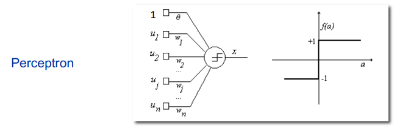
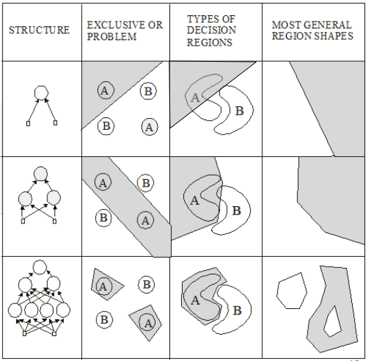
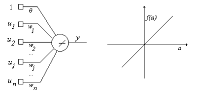

## Neural Networks ##
-------------------------

The brain's method of storing and recalling information is not fully understood, but research has shown that neurons gradually modify their characteristics when exposed to stimuli. The changes mostly occur in the electrical and chemical properties of the synaptic junctions, which can alter the response of the post-synaptic neuron. This modification effectively changes the weighting of inputs to a neuron, affecting whether it will fire. The chapter will focus on learning in feedforward networks.

### Perceptron Convergence Procedure ###
-----
 * may have continuous valued inputs.
 * The activation function is knowns as:
        $$
        \alpha = \textbf{w}^T\textbf{u} + \theta
        $$
 * its output function is:
        $$
        \alpha = \begin{cases}
        +1 & \text{if } \alpha \geq 0 \\
        -1 & \text{otherwise}
        \end{cases}
        $$
 
 

 * in N dimensional space, the equation:
        $$
        \textbf{w}^T\textbf{u} + \theta = 0
        $$
    that is,
        $$
        \sum_{i=1}^N w_iu_i + \theta = 0
        $$
    also can be expressed as:
        $$
        w_1u_1 + w_2u_2 + \cdots + w_Nu_N + \theta = 0
        $$
    defining a hyperplane in N dimensional space.

 * The perceptron divides the space into two parts, one section has +1 as output, the other has -1 as output.

 * A perceptron can be used to classify input vector belonging to one of two classes.

 Example 1: Input space is two-dimensional.
    $$
    w_1u_1 + w_2u_2 + \theta = 0
    $$
 defines a line in two-dimensional space.
 one dimension is the x-axis, the other is the y-axis. These correspond to the first and second components of the input vector $\textbf{u}$, respectively.

**The procedure for training a perceptron is as follows:**

1. Initialize the weights and threshold to small random values.
    - The weights are initialized to small random values, so that the perceptron will not fire immediately.
    - Set each $w_j(0)$, for $j=0,1,2,..,N$ in $w(0)$ to small random values. Here $\textbf{w}=\textbf{w}(t)$ is the weight vector at iteration time t and the component $w_0=\theta$ corresponds to the bias.

2. Present the new input and desired output.
    - new continuous valued input vector $\textbf{u}^k$ with corresponding output $y^k$ is presented such that.
        $$
        y^k = \begin{cases}
        +1 & \text{if } \textbf{w}^T\textbf{u}^k + \theta \geq 0 \\
        -1 & \text{otherwise}
        \end{cases}
        $$
3. Compute the actual output.
        $$
        x^k = f(\textbf{w}^T\textbf{u}^k)
        $$
4. Update the weights.
        $$
        \textbf{w}(t+1) = \textbf{w}(t) + \eta(y^k - x^k(t))\textbf{u}^k
        $$
 5. Repeat steps 2-4 until the network converges.

 In [Rosenblatt, 1959] it is proved that if the inputs presented from the two classes are
linearly separable, that is they fall on opposite sides of some hyperplane, then the
perceptron convergence procedure always converges in time. Furthermore, it positions
the final decision hyperplane such that it separates the samples of class A from those of
class B.

One problem with the process is that decition boundary may oscillate when the distributions overlap, or the classes are not linearly separable.

### LMS Learning Rule ###
-----
 * A modification to convergence procedure forms the Least Mean Square (LMS) solution.

 * This solution minimizes the mean square error between the desired and actual output.

 * First proposed for Adaline (Adaptive Linear Neuron) by Widrow and Hoff in 1960.
 

 * The output funciton for Adaline is:
        $$
        f(a)=a
        $$
    - so the output can be written in terms of input and weights.
        $$
        x = f(a) = \sum_{j=0}^N w_ju_j
        $$
    - The output equation can be written in matrix form as:
        $$
        \textbf{x} = \textbf{w}^T\textbf{u}
        $$
    where $\textbf{x}$ is the output vector, $\textbf{w}$ is the weight vector, and $\textbf{u}$ is the input vector.
    - We have a set of input vectors $\textbf{u}^k$, $k=1,2,3,...,K$, and corresponding desired output vectors $\textbf{y}^k$, $k=1,2,3,...,K$.
    - The error vector is defined as:
        $$
        \textbf{e}^k = \textbf{y}^k - \textbf{u}^k = \textbf{y}^k - \textbf{w}^T\textbf{u}^k
        $$
    - The mean square error is defined as:
        $$
        <(\epsilon^k)^2> = \lim_{K\rightarrow\infty}\frac{1}{K}\sum_{k=1}^K(\epsilon^k)^2 = \lim_{K\rightarrow\infty}\frac{1}{K}\sum_{k=1}^K(\textbf{y}^k - \textbf{w}^T\textbf{u}^k)^2 \newline
        = \lim_{K\rightarrow\infty}\frac{1}{K}\sum_{k=1}^K(\textbf{y}^k - \textbf{w}^T\textbf{u}^k)^T(\textbf{y}^k - \textbf{w}^T\textbf{u}^k)
        $$
        - Defining the input correlation matrix as:
        $$
        \textbf{R} = \lim_{K\rightarrow\infty}\frac{1}{K}\sum_{k=1}^K\textbf{u}^k\textbf{u}^{kT}
        $$
        - and a vector P as:
        $$
        \textbf{P} = \lim_{K\rightarrow\infty}\frac{1}{K}\sum_{k=1}^K\textbf{y}^k\textbf{u}^{k}
        $$
        - the mean square error can be written as:
        $$
        e(\textbf{w}) =
        <(\epsilon^k)^2> =
        <(y^k)^2> + 
        \textbf{w}^T\textbf{R}\textbf{w} - 2\textbf{P}^T\textbf{w}
        $$

    - The optimum $\textbf{w}$ is the one that minimizes the mean square error.
        $$
        \nabla e(\textbf{w})\vert_{\textbf{w = w*}}^{} =
        \frac{\partial e(\textbf{w})}{\partial \textbf{w}}\vert_{\textbf{w = w*}}^{} = 
        2\textbf{R}\textbf{w}^* - 2\textbf{P} = 0 
        $$
        - here, the gradient is
        $$\nabla e(\textbf{w}) =
        \begin{bmatrix}
        \frac{\partial e(\textbf{w})}{\partial w_0} & \frac{\partial e(\textbf{w})}{\partial w_1} & \frac{\partial e(\textbf{w})}{\partial w_2} & \cdots & \frac{\partial e(\textbf{w})}{\partial w_n}\\
        \end{bmatrix}^T
        $$
    - The error funciton is second degree, hence a single minimum exists.
    - The solution is:

    $$
    \textbf{R}\textbf{w}^* = \textbf{P}
    \newline
    \textbf{w}^* = \textbf{R}^{-1}\textbf{P}
    $$
 - The analytical calculation of optimum weight vector is rather difficult. Not only does the matrix manipulation get cumbersome, but also each component of $\textbf{R}$ and $\textbf{P}$ itself is an *expectation* value.

 - Adaline linear combiner finds it iteratively.

 ### Steepest Descent Algorithm ###
-----

 ### Backpropagation Algorithm ###
-----
 single-layer, multiple-output network
 * The network has N inputs and M outputs.
 * in vector notation weights are:
    $$
    \textbf{w} = \begin{bmatrix}
    w_{11} & w_{12} & \cdots & w_{1M} \\
    w_{21} & w_{22} & \cdots & w_{2M} \\
    \vdots & \vdots & \ddots & \vdots \\
    w_{N1} & w_{N2} & \cdots & w_{NM} \\
    \end{bmatrix}
    $$
* The output of the network is:
    $$
    \textbf{y} = \begin{bmatrix}
    y_1 \\
    y_2 \\
    \vdots \\
    y_M \\
    \end{bmatrix}
    $$
* The input vector is:
    $$
    \textbf{u} = \begin{bmatrix}
    u_1 \\
    u_2 \\
    \vdots \\
    u_N \\
    \end{bmatrix}
    $$
* The error can be defined as the desired outcome (y) minus the actual outcome (x):
    $$
    e_i^k = y_i^k - x_i^k
    $$
here the outcome can be replaced with the output of the network:
    $$
    e_i^k = y_i^k - \sum_{j=1}^N w_{ji}u_j^k
    $$
also in vector notation:
    $$
    \textbf{e}^k = \textbf{y}^k - \textbf{w}^T\textbf{u}^k
    $$

* The error function is the sum of the squared errors:
    $$
    E = \frac{1}{2}\sum_{k=1}^K\sum_{i=1}^M(e_i^k)^2
    $$
    - The factor of 1/2 is included for convenience in the gradient calculation.
    - The error function is a function of the weights.
    - The gradient of the error function is:
        $$
        \nabla E = \begin{bmatrix}
        \frac{\partial E}{\partial w_{11}} & \frac{\partial E}{\partial w_{12}} & \cdots & \frac{\partial E}{\partial w_{1M}} \\
        \frac{\partial E}{\partial w_{21}} & \frac{\partial E}{\partial w_{22}} & \cdots & \frac{\partial E}{\partial w_{2M}} \\
        \vdots & \vdots & \ddots & \vdots \\
        \frac{\partial E}{\partial w_{N1}} & \frac{\partial E}{\partial w_{N2}} & \cdots & \frac{\partial E}{\partial w_{NM}} \\
        \end{bmatrix}
        $$
* 